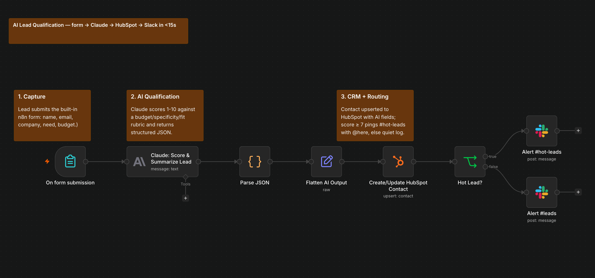
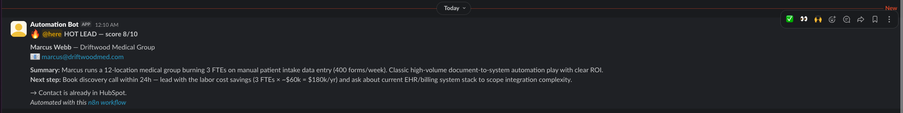
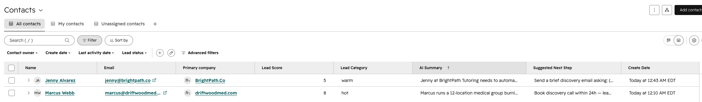

# AI Lead Qualification — n8n + Claude + HubSpot + Slack

A lead fills out your form. Within seconds, AI scores and summarizes them,
they're in your CRM, and your sales channel gets pinged — hot leads flagged
with @here. No human touched anything.

🎥 **[90-second demo (Loom)](PASTE_LOOM_URL)**

## The problem

Leads sit in inboxes for hours. Sales responds too late — and response time
is the #1 conversion factor (leads contacted within 5 minutes convert many
times better than those contacted after an hour). Meanwhile someone still
has to re-type every submission into the CRM.

## The build

1. **Capture** — n8n's built-in Form Trigger (name, email, company, need, budget)
2. **AI qualification** — Claude (Haiku) scores the lead 1–10 against an explicit
   rubric (budget / problem specificity / fit) and returns structured JSON:
   score, category (hot/warm/cold), a 2-sentence summary written for a
   salesperson, and a suggested next step
3. **CRM** — HubSpot contact created/updated with the AI fields as custom properties
4. **Routing** — score ≥ 7 → `#hot-leads` with @here; otherwise quiet log to `#leads`
5. **Error handling** — a separate error workflow alerts Slack if any node fails

**Stack:** n8n (self-hosted, Docker) · Anthropic Claude · HubSpot · Slack

## The result

Form submission → scored, summarized, in HubSpot, sales alerted: **under 15 seconds.**

**Hot lead alert**

**CRM record with AI fields**

The rubric prompt returns strict JSON even on junk input (spam and blank
fields score low and route quietly instead of crashing the flow).

## Run it yourself

1. Import `workflow/AI_Lead_Qualification.json` into n8n (v1.100+)
2. Add credentials: Anthropic API key, HubSpot Private App token, Slack bot token
   (`chat:write`, `chat:write.public`)
3. Create 4 HubSpot custom contact properties: `lead_score` (number),
   `lead_category` (dropdown: hot/warm/cold), `ai_summary`, `suggested_next_step`
4. Create Slack channels `#hot-leads` and `#leads`, activate the workflow,
   and share the form's production URL
5. Also import `workflow/Error_Handler_Slack_Alert.json` (posts to
   `#n8n-failures`), then set it under **Workflow settings → Error Workflow**

---

*Built by Muhammad M Ud-Din — integration & AI automation engineer.
I build systems like this for businesses drowning in manual processes.
[nexbridgeit.com](https://nexbridgeit.com)*